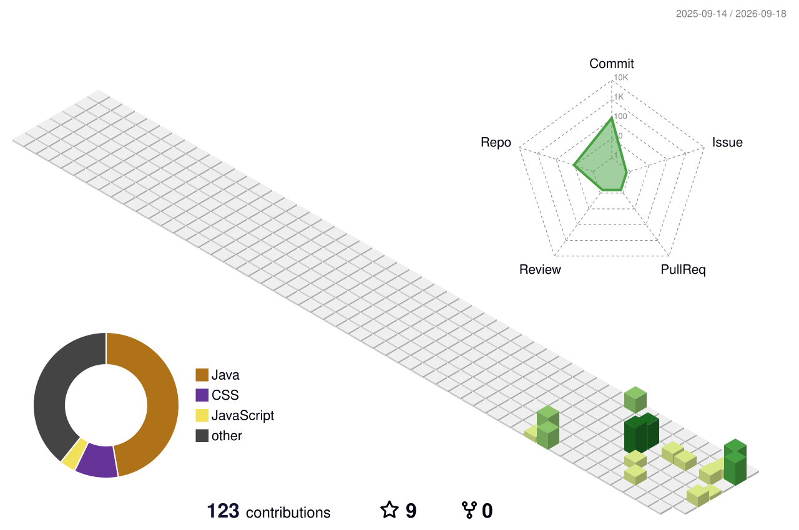

# 👩🏻‍💻 Kritika Singh

### 💻 Java Developer • Backend Developer • Software Engineer

**Building scalable, secure & real-world applications with Java & Spring Boot ☕🚀**

  

---

## 👩🏻‍💻 About Me

I am a <b>B.Tech CSE</b> student passionate about <b>Java, Backend Development, DSA and Software Engineering</b>.
 
Currently focused on building practical applications using <b>Spring Boot, REST APIs, PostgreSQL and Spring Security</b>.

| 🎓 Education | ☕ Primary Language | 💻 Role | 🌱 Currently Learning |
|---|---|---|---|
| B.Tech CSE @ MIET | Java | Backend Developer | Spring Boot & REST APIs |

---

## 🚀 What I'm Currently Doing

<table>
<tr>
<td width="50%">

### ☕ Java & DSA

Strengthening Core Java, Collections, OOP, DSA and problem-solving skills.

</td>
<td width="50%">

### 🌱 Backend Development

Building applications using Spring Boot, REST APIs, PostgreSQL and Spring Security.

</td>
</tr>

<tr>
<td width="50%">

### 🔐 Secure Applications

Learning authentication, authorization and secure backend architecture.

</td>
<td width="50%">

### 🧩 Real-World Projects

Turning ideas into practical applications that solve real problems.

</td>
</tr>
</table>

---

# 🛠️ Tech Stack

### 💻 Languages

### ⚙️ Backend & Frameworks

### 🗄️ Databases

### 🧰 Tools & Platforms

---

# 🧠 Core Concepts

---

# ⭐ Featured Projects

## 🔗 Kritika URL Shortener

> A secure URL shortening platform built with Spring Boot.

**Tech:** `Spring Boot` `Spring Security` `PostgreSQL` `Flyway` `Thymeleaf` `Docker`

### ✨ Features

- 🔐 User authentication & authorization
- 🔗 Short URL generation
- ✨ Custom URLs
- 📊 Click analytics
- 🐳 Docker support
- 🗄️ Database migrations with Flyway

---

## 📊 Sorting Visualizer

> Interactive visualization tool for understanding sorting algorithms.

**Tech:** `HTML` `CSS` `JavaScript`

### ✨ Features

- 📊 Algorithm visualization
- ⚡ Adjustable speed
- 🔄 Multiple sorting algorithms
- 🎨 Interactive interface

---

## ☕ Java Pattern Programs

> Java programs focused on logic building and programming fundamentals.

### ✨ Includes

`⭐ Star Patterns` `🔢 Number Patterns` `🔤 Alphabet Patterns` `🔄 Nested Loops` `💡 Logic Building`

---

## 🧩 Object-Oriented Programming

> Practical Java implementations of core OOP principles.

### ✨ Includes

`Abstraction` `Encapsulation` `Inheritance` `Polymorphism` `Interfaces` `Upcasting` `Method Overloading` `Method Overriding`

---

## 🧮 Basic Maths — Java

> Java programs focused on mathematical logic and problem solving.

### ✨ Includes

`Armstrong Number` `GCD` `LCM` `Palindrome` `Perfect Number` `Prime Number` `Reverse Number` `Sum of Digits`

---

# 📊 GitHub Activity

  

---

# 🧊 3D Contribution Calendar

 

### `Consistency builds results.`

---

# 🐍 Contribution Activity

---

# 📈 My GitHub Journey

### `Learning → Building → Improving → Repeating 🔁`

 

---

# 🎯 2026 Goals

<table>
<tr>

<td align="center" width="25%">

### ☕

**Master Java**

Core Java + Collections + DSA

</td>

<td align="center" width="25%">

### 🌱

**Spring Boot**

Build production-ready APIs

</td>

<td align="center" width="25%">

### 🧩

**Projects**

Build & deploy real applications

</td>

<td align="center" width="25%">

### 💼

**Career**

Grow as a Backend Developer

</td>

</tr>
</table>

---

# 📚 Learning Journey

| Area | Focus |
|---|---|
| ☕ Java | Core Java, OOP, Collections |
| 🧠 DSA | Problem Solving & Algorithms |
| 🌱 Spring Boot | REST APIs & Backend Development |
| 🗄️ Database | PostgreSQL, MySQL |
| 🔐 Security | Authentication & Authorization |
| 🐳 DevOps | Docker & Git |
| 🧩 Projects | Real-world Application Development |

---

# 💡 Developer Mindset

### `Learn → Build → Break → Debug → Improve → Repeat 🔁`

**Every bug is a lesson.  
Every project is progress.  
Every day is a chance to get better. 🚀**

---

# 🤝 Let's Connect

### Open to opportunities, collaborations & interesting projects 🚀

 

  

**💜 Turning ideas into software, one project at a time.**

### ⭐ Thanks for visiting my profile!

