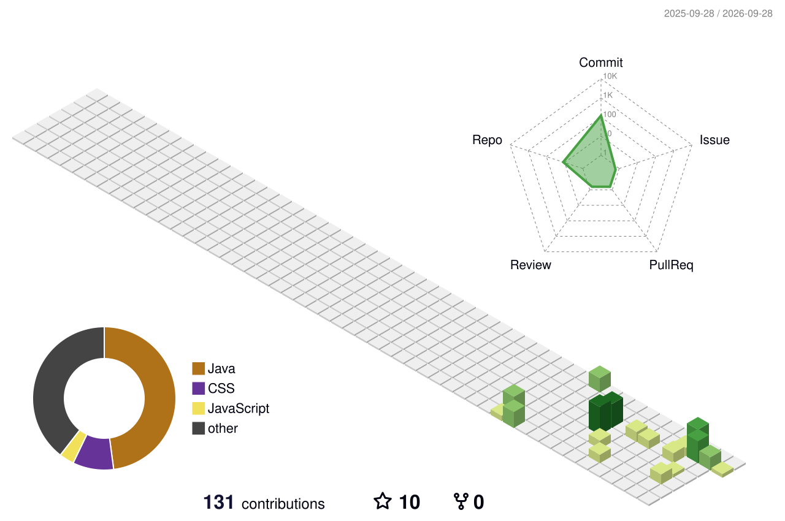

 

 

&nbsp;

&nbsp;

---

<table>
<tr>
<td width="68%" valign="middle">

### 👋 Hey, I'm Kritika Singh

> **Java Backend Developer & Software Engineer** building clean, practical and scalable applications with **Java, Spring Boot & REST APIs**, while exploring **Generative AI, RAG & LLMs**.

</td>

<td width="32%" align="center">

### `CURRENT FOCUS`

🟣 Java + DSA  
🔵 Spring Boot  
🟢 Backend Systems  
💗 AI + RAG  
🔷 LLMs

</td>
</tr>
</table>

 

---

<table>
<tr>
<td></td>
<td></td>
<td></td>
<td></td>
<td></td>
</tr>
</table>

<table>
<tr>

<td align="center" width="33%">

 
<b>Java • Backend • AI</b>

</td>

<td align="center" width="33%">

 
<b>Practice • Learn • Improve</b>

</td>

<td align="center" width="33%">

 
<b>AI Career Copilot • URL Shortener • Sorting Visualizer</b>

</td>

</tr>
</table>

---

### ✦ FEATURED BUILDS ✦

<table>
<tr>

<td width="33%" align="center">

  

AI-powered career platform using <b>Spring AI, RAG, PostgreSQL & PGVector</b>.

 

</td>

<td width="33%" align="center">

  

Secure URL shortening system with <b>Spring Boot, Security, PostgreSQL & analytics</b>.

 

</td>

<td width="33%" align="center">

  

Interactive sorting visualizer with <b>multiple algorithms, speed control & dynamic UI</b>.

 

</td>

</tr>
</table>

---

# 💜 ABOUT ME

<table>
<tr>

<td width="64%" valign="top">

## Hey, I'm Kritika 👋

I'm a **Computer Science Engineering graduate** focused on **Java Backend Development** and **Software Engineering**.

I enjoy building things that are **clean, practical and actually work** — from Spring Boot APIs and database systems to AI-powered applications.

### My main focus

### Currently exploring

`BUILD` • `LEARN` • `SOLVE` • `GROW`

</td>

<td width="36%" align="center">

### `CURRENTLY`

🟣 **Java + DSA**

🔵 **Spring Boot**

🟢 **Backend Systems**

💗 **Generative AI**

🔷 **RAG + LLMs**

</td>

</tr>
</table>

---

# ⚡ TECH UNIVERSE

<table>
<tr>

<td width="25%" align="center">

### 💻 LANGUAGES

`Java`  
`JavaScript`  
`HTML`  
`CSS`

</td>

<td width="25%" align="center">

### 🌱 BACKEND

`Spring Boot`  
`Spring Security`  
`REST APIs`  
`JDBC`  
`Hibernate`

</td>

<td width="25%" align="center">

### 🗄️ DATABASE

`PostgreSQL`  
`MySQL`  
`MongoDB`  
`PGVector`

</td>

<td width="25%" align="center">

### 🤖 AI

`Spring AI`  
`RAG`  
`LLMs`  
`Embeddings`  
`Ollama`

</td>

</tr>
</table>

 

---

# 🚀 FEATURED PROJECTS

<table>
<tr>

<td width="50%" valign="top">

## 🤖 AI CAREER COPILOT

AI-powered career intelligence platform built with **Java + Spring Boot + Spring AI**.

### ✨ FEATURES

📄 Resume PDF ingestion  
🧠 AI resume analysis  
🎯 Resume ↔ Job matching  
💬 RAG resume chat  
📊 Skill gap analysis  
🎤 Interview question generation  
🗺️ Personalized career roadmap  
🔒 Local AI with Ollama

### STACK

`Java` `Spring Boot` `Spring AI`  
`RAG` `PostgreSQL` `PGVector` `Docker`

</td>

<td width="50%" valign="top">

## 🔗 URL SHORTENER

Secure URL shortening platform with authentication, custom URLs, analytics and persistent storage.

### ✨ FEATURES

🔐 User authentication  
🔗 Short URL generation  
✨ Custom URLs  
📊 Click analytics  
🗄️ PostgreSQL persistence  
🔄 Flyway migrations  
🐳 Docker setup

### STACK

`Java` `Spring Boot` `Spring Security`  
`PostgreSQL` `Flyway` `Thymeleaf`

</td>

</tr>

<tr>

<td width="50%" valign="top">

## 📊 SORTING VISUALIZER

Interactive sorting algorithm visualization tool.

### ✨ FEATURES

📊 Algorithm visualization  
⚡ Adjustable speed  
🔄 Multiple algorithms  
🎨 Interactive interface

### STACK

`HTML` `CSS` `JavaScript`

&nbsp;

</td>

<td width="50%" valign="top">

## ☕ JAVA LAB

My Java practice space for strengthening programming fundamentals and problem solving.

🧩 OOP  
📦 Collections  
🔢 Arrays  
✨ Patterns  
🧮 Basic Maths  
⚡ Bitwise Operators

</td>

</tr>
</table>

---

# 🧠 CODE SPACE

<table>
<tr>

<td align="center" width="33%">

### ☕ JAVA

`Core Java`  
`OOP`  
`Collections`  
`DSA`

</td>

<td align="center" width="33%">

### ⚡ PROBLEM SOLVING

`Arrays`  
`Hashing`  
`Sorting`  
`Two Pointers`

</td>

<td align="center" width="33%">

### 🤖 AI EXPLORATION

`LLMs`  
`RAG`  
`Embeddings`  
`Vector Search`

</td>

</tr>
</table>

---

# 🌌 3D CONTRIBUTION CITY

<code>CODE • BUILD • LEARN • GROW</code>

 

 

---

# 🗺️ CODING JOURNEY

&nbsp;→&nbsp;

&nbsp;→&nbsp;

&nbsp;→&nbsp;

&nbsp;→&nbsp;

&nbsp;→&nbsp;

 

---

# 💫 LET'S CONNECT

 

&nbsp;

&nbsp;

&nbsp;

&nbsp;

  

